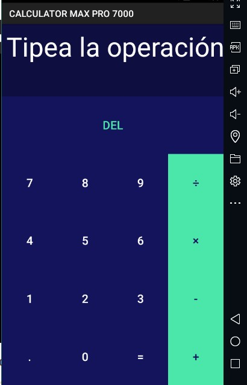
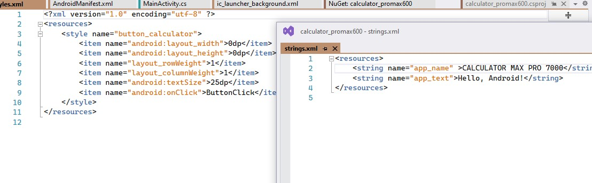

# Calculator App with Xamarin :heart:
###### Integrants:
###### Erick Andrade | Jhosef Rea | Christian Soledispa | Josue Singaña
### Welcome to the Xamarin Project with a basic calculator  of numbers

##### 1. Create a view whereby adding an Grid and TextView with an identifier as "@+id/calculator_text_view" is neccesary to catch the string of user will put

##### 2. Adding an Nuget Package related to the Grid.

##### 3. Then we are going to put the styles and strings whereby we use in the app.

##### 4. Adding some vars neccesaries to TextView(catching the string of user will put as "calculator_text_view"), array(results of the operations of numbers) and operator(validator of string) .

##### 5. Calling a function where we need to catch which button was touched  and inside function validates the full string(with if and else) and according to that calling the respective function .

##### 6. The next function calculate tried to search which operator is the indicate to do the operation and we validate if the numbers are nulls or no. But the function erase only put null to the array.

##### 7. Update the string to the user only we needed to recolocate the values that we did in "calculatorText".

##### 8. Here we got the last step is the result. Thanks for reading. :racehorse:.

